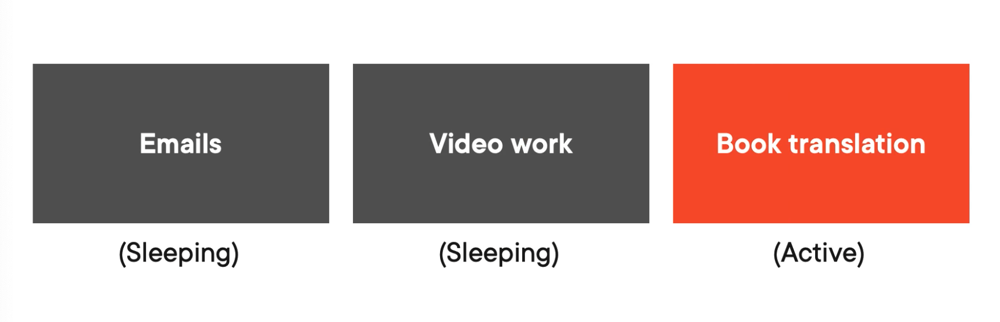
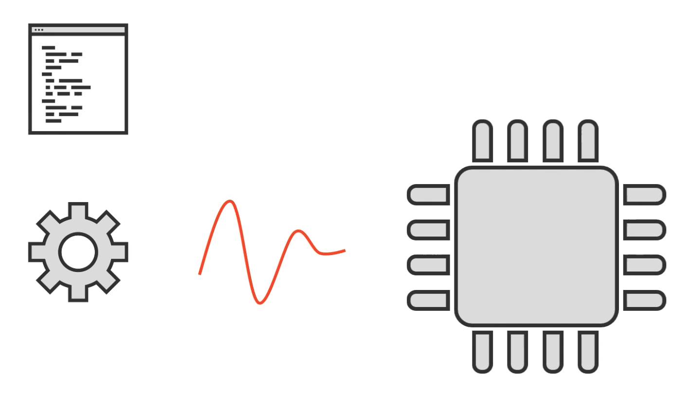
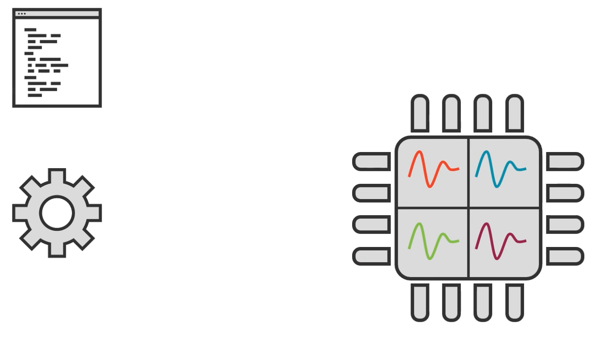
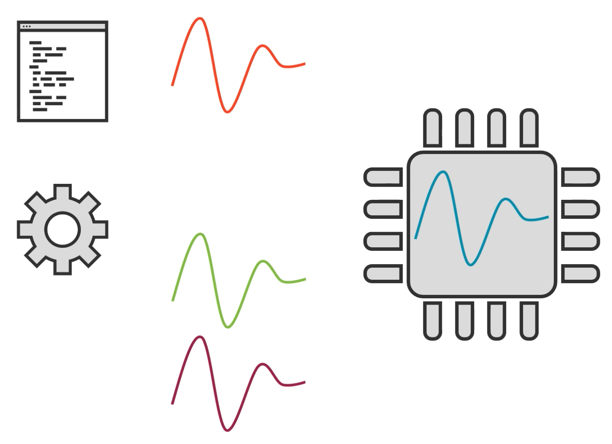

## Explaining Concurrency

What is concurrency? It's about creating multiple processes that execute independently. (not simultaneously, not parallel)

Imagine you have a bunch of tasks in the morning. You write an email and are waiting for a response. You're uploading a video and waiting for that to finish. While you're waiting for those two things to finish, you're working on your book translation.

Concurrency vs parallelism: at no point in this process are you actually doing two things at the same time. You wrote one email, then only after you sent it you switched to uploading a video. And you didn't switch to book translation until you had clicked the upload button. 

Concurrency: Lots of tasks "on the go", but only one is "active".

Concurrency *deals* with lots of things at once, while parallels *does* lots of things at once.

## Concurrency in computer programs

In order to understand how Go uses concurrency, we need a quick CS overview.

Computers have processors. In this example, we'll assume it has a single core. We also have an application and when we run it, the OS creates a process, which is the runtime instance of the program, which tracks memory, handles files, I/O, etc. And this process starts out with a single thread, being the thing that executes the process code.

A program starts on a single thread but it can launch more but it is the job of the OS to schedule threads on cores.

This is a common way to achieve concurrency or even parallelism if you have multiple cores.

In parallelism, it runs different threads on different cores.

In concurrency, only one of these threads is actually working at any given time.

If you're not careful threads can drag down performance.
Good thing Go doesn't use threads for concurrency! (wait what???)

## Go's concurrency model

## Writing a concurrent program

## Channels

## Recap