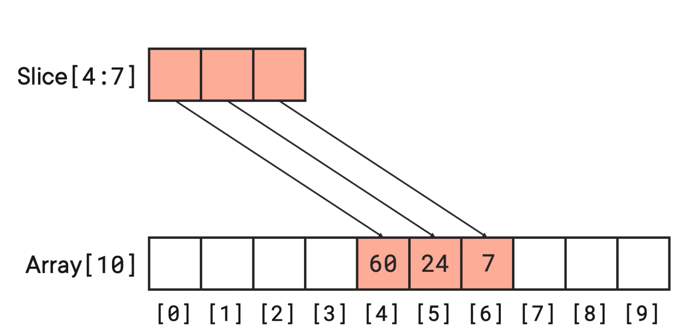
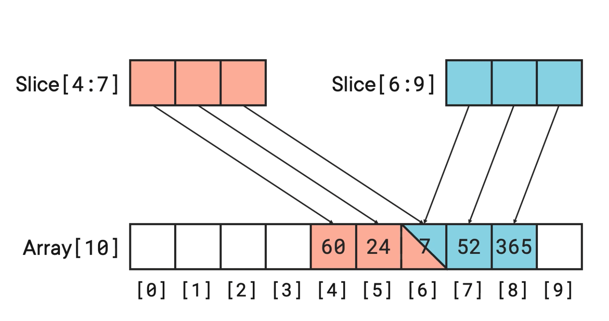

## Theory
We're basically talking about numbered (indexed) lists where everything has to be the same type. All strings, or all ints etc.  

## Arrays vs Slices
You will rarely see arrays used directly in Go. Mostly slices.

Arrays:
- have a fixed size.

Slices: 
- look and feel like arrays but can be resized.
- actually built on top of arrays
- contiguous section of the array
- are references by nature. 

(no actual data gets stored in the slice construct. it's basically pointers pointing to the actual data in the array, meaning the slice itself is basically a name, a type, and offset, and a length)



And we can have multiple slices for one array and since they're just pointers, it's very cheap.



However changing the value in any element in one of the slices changes it in the array below, meaning every other slice that references it sees the change. Important to know when passing slices as arguments to functions.


## Working with Slices

You can use the built in `make` function

```
func main() {
    courses := make([] string, 5, 10)
}
```

It accepts three values: type, length, and capacity (specifies the expected or max size of the length)

So to create a slice, we have to create the array that stores the data.

```
courses := []string{
    "Docker & Kubernetes: The Big Picture",
    "Getting Started with Docker",
    "Getting Started with Kubernetes",
}
```

## Getting Under The Hood
We can manipulate slice elements by putting the element's index value inside of `[]`

```
courses := make([]string, 5, 10)
	courses[0] = "Docker & Kubernetes: The Big Picture"
	courses[1] = "Getting Started with Docker"
	courses[2] = "Getting Started with Kubernetes"
```

We can slice a slice. To make a slice smaller. To do that we create a new slice and tell it to point to a subsection of the existing slice.

```
sliceOfSlice := mySlice[2:5]
```

Include 2 <- `[2:5]` -> exclude 5

If we don't put anything in front of the colon, it implies index at position 0 `[:5]`

Same thing in reverse, `[4:]` will imply the end of the slice.

## Expanding Slices
To grow an array, use built in `append()` function. Go will take the current capacity of the underlying array, and for each append it adds data to the next slot in the array. As soon as we add one without an available slot, Go automatically doubles the capacity of the array. It does this by creating a new backing array, double the size, copies over the values and other things to make the process seamless.

## Miscellaneous
 `for range` loops are perfect for working with slices. It returns two values for every iteration of a loop, the index value and the data itself. If we don't care about the index value we can skip it with and underscore.

 ```
for _, i := range mySlice {
    fmt.Println(i)
}
 ```

You can totally append slices to other slices, except it doesnt actually append one slice to the other, it appends the values of one slice to the end of the existing one. 

You can't append slices of different types. 

```
newSlice := []int{10, 20, 30}
mySlice = append(mySlice, newSlice...)
```

## Recap