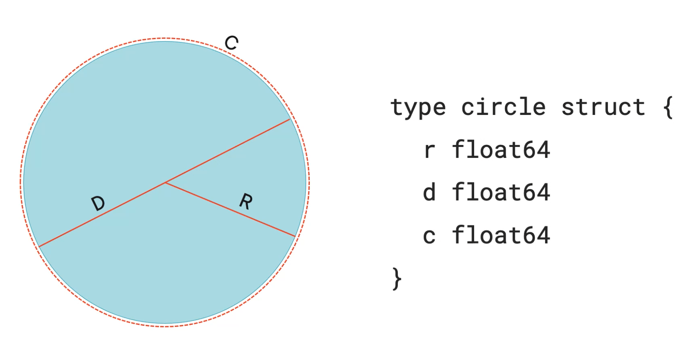
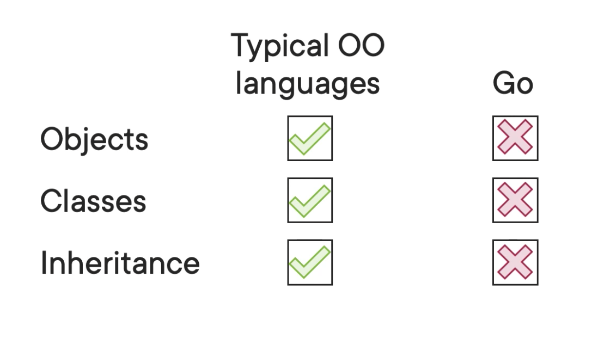

## What is a Struct?

Structs are how we define custom data types. For example, if you wanted to have a circle type and it knows things like radius, diameter, and circumference.



The fields making up a struct do **not** have to all be the same data type. A struct just defines a type. It does not instantiate any variables.

A person struct, for example.
```
type person struct {
    name string
    age int
    pronouns string
    eyeColor string
    hairColor string
}
```

## Object-oriented programming in Go

No.



## Defining Structs
We actually can define new types as simple ints and strings and whatnot. So even tho there's already an int type. We can create a new int type that is a simple int as well. The reason we do this is so that we can assign methods to custom types.

Two ways to define

```
type courseMeta struct {
    author string
    level string
    rating float64
}

var gettingStartedWithK8s courseMeta
gettingStartedWithK8s := new(courseMeta)
```

All fields will initialize with default 0 values
The difference in the second one is that it uses the new keyword and yields a pointer.

The `composite literal` form looks like this. In this case we're initializing the values as well:

```
gettingStartedWithK8s := courseMeta{
    author: "Nigel Poulton",
    level: "Intermediate",
    rating: 5,
}
```

## Workings with Structs

We access individual fields in a struct with the `.` operator.

```
fmt.Println("Author:", gettingStartedWithK8s.author)

```

We can also use `.` to change fields. If you've already declared an instance, you can use the `=` to assign new values
```
gettingStartedWithK8s.rating = 2
```

## Recap

Go's way of defining custom types that we can use just like regular variables. A struct is a new type with an arbitrary number of fields, with each field being named and having its own specific type, and each field can be of a different type.